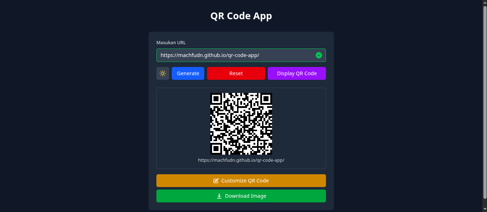

<h1 align="center">Selamat datang di QR Code App! 👋</h1>

## User Interface



## QR Code App

Web App yang digunakan untuk membuat qr code dari teks maupun link url dengan menggunakan react

## Live Demo

Live Demo : [Lihat QR Code App](https://machfudn.github.io/qr-code-app/)

## Fitur Utama

- Download QR Code Gambar
- Dukungan dark & light mode
- Responsif di semua perangkat
- Customisasi warna QR Code

## Teknologi yang Digunakan

| Teknologi    | Deskripsi                  |
| ------------ | -------------------------- |
| React        | Frontend framework         |
| Tailwind CSS | Styling modern & responsif |
| Typescript   | Bahasa Pemrograman         |

## Instalasi Lokal

```bash
# Clone repository
git clone git@github.com:machfudn/qr-code-app.git
cd qr-code-app

# Install dependencies
npm install

# Jalankan aplikasi
npm run dev
```
